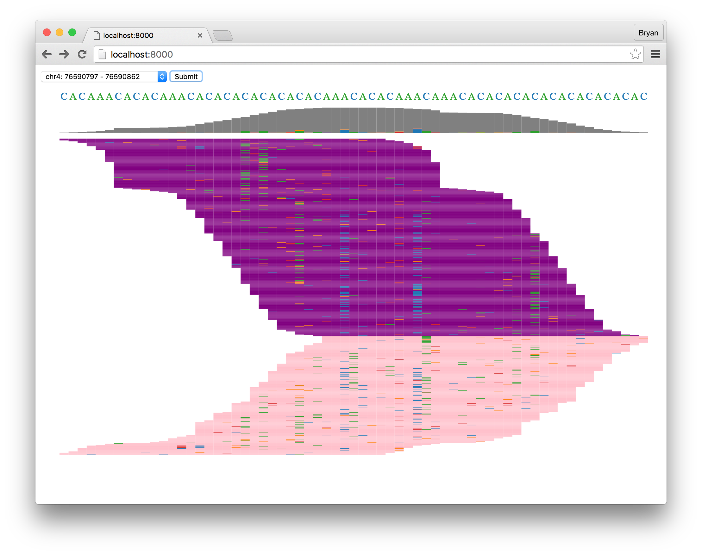

# oncoview

This is a hobby project using [D3](https://d3js.org/) to recreate a lightweight [Integrated Genome Viewer](https://www.broadinstitute.org/igv/)-like interface for viewing genomic sequencing data.

This project does not currently allow for processing reads from real BAM files; all data is simulated via crude model (no indels, no correlation between read presence for multiple SNPs, etc).   This is just a visualization exercise.

[]()
[](https://codeclimate.com/github/dbjohnson/looptimer)

## Quickstart

Task|Command
----|-------
Dependencies| `pip install -r requirements.txt`
HTTP server| `gunicorn app:wsgi`


## Sample output


  
## API Routes
**POST /reads**

Returns simulated reads with randomized read length, read errors and [SNPs](https://en.wikipedia.org/wiki/Single-nucleotide_polymorphism).  The reference sequence is randomized.

```json
{
  "reference": "TGCTAGCTGG",
  "coverage": [
    {
      "A": 0,
      "C": 0,
      "G": 1,
      "T": 13,
    },
    {
      "A": 0,
      "C": 0,
      "G": 7,
      "T": 0,
    },
    ...
  ],
  "reads": [
    {
      "fwd": false,
      "start": 4,
      "sequence": "AGCT"
    },
    {
      "fwd": true,
      "start": 2,
      "sequence": "CTAGC"
    },
    ...
  ]
}
```


**Optional arguments**

These arguments specify the simulation model parameters

```json
{
  "sequence_length": 80,
  "tumor_content": 0.3,
  "read_error_rate": 0.03,
  "max_SNPs": 4,
  "num_reads": 100
}
```
