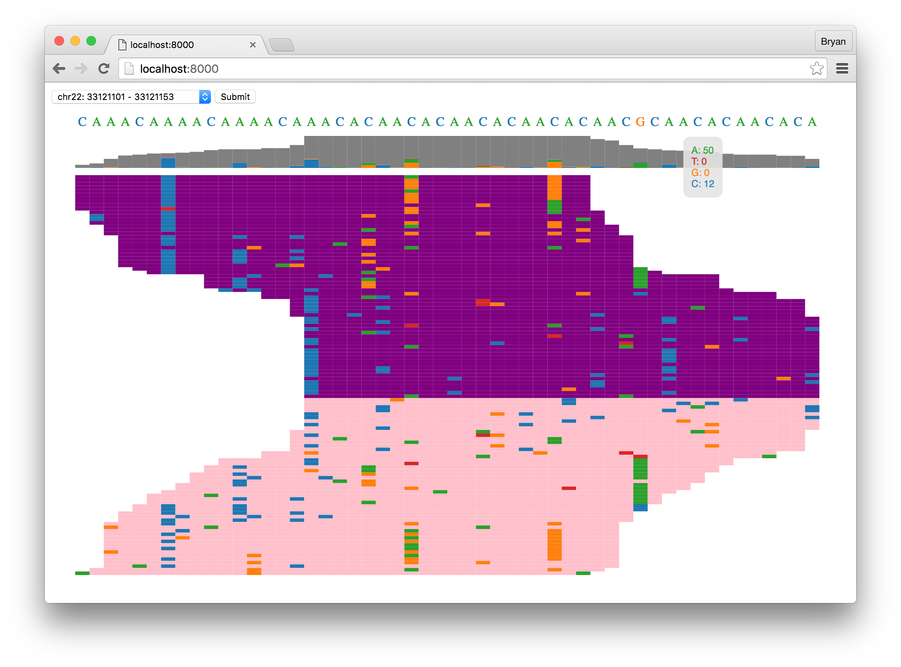

# d3igv

[]()
[](https://codeclimate.com/github/dbjohnson/d3igv)

This is a hobby project using [D3](https://d3js.org/) to recreate a lightweight [Integrated Genome Viewer](https://www.broadinstitute.org/igv/)-like interface for viewing genomic sequencing data.

A sample BAM file is included, along with a crude model that can be used to generate simulated reads.  The bedfile for the sample BAM was generated using the [make_bedfile.py](scripts/make_bedfile.py) script, which simply searches for regions with good coverage.


## Quickstart

Task|Command
----|-------
Dependencies| `pip install -r requirements.txt`
HTTP server| `gunicorn app:wsgi`


## Sample output
[Live demo](https://dbjohnson.github.io/d3igv)


  
## API Routes
**POST /reads**

```json
{
  "chrom": "chr1",
  "start": 10000,
  "end": 10100
}
```

Sample output

```json
{
  "reference": "TGCTAGCTGG",
  "coverage": [
    {
      "A": 0,
      "C": 0,
      "G": 1,
      "T": 13,
    },
    {
      "A": 0,
      "C": 0,
      "G": 7,
      "T": 0,
    },
    ...
  ],
  "reads": [
    {
      "fwd": false,
      "start": 4,
      "sequence": "AGCT"
    },
    {
      "fwd": true,
      "start": 2,
      "sequence": "CTAGC"
    },
    ...
  ]
}
```


